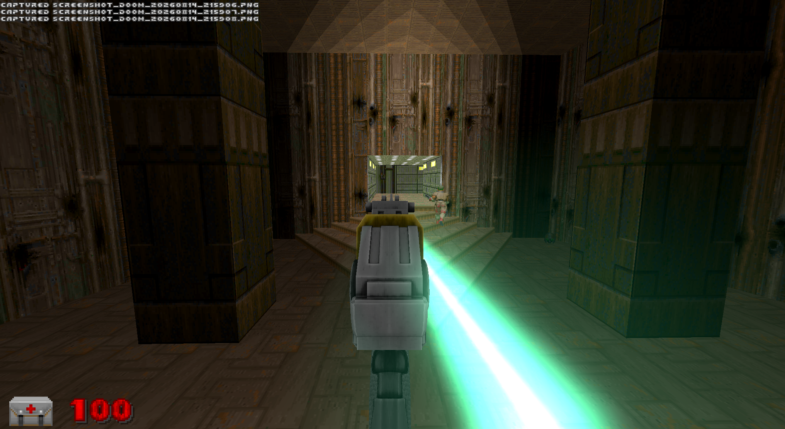
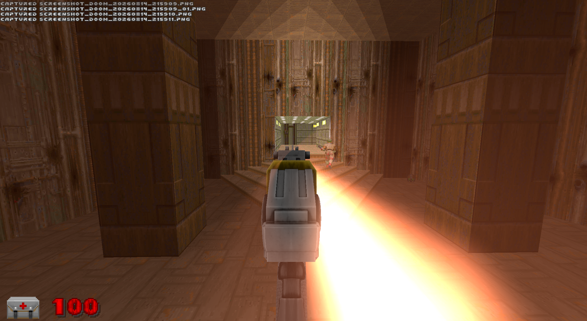

# The Lance

A real beam weapon for the **UZDXREMA** engine fork. Not a sprite, not a chain
of puffs — the engine lights every pixel by its distance from the beam, so it is
continuous at any length, hangs in the air, and lights the room it crosses.

And it doesn't fire. There are no shots. It's **on**, and while it's on it burns.

| | |
|---|---|
|  |  |
|  |  |
|  |  |
|  |  |

*Shot on desktop, where the gun is a screen overlay with no world position, so
the muzzle has to be guessed at. In VR it comes out of the barrel — the tracked
controller is a real point in the world, nothing to guess.*

---

## Coming

- **A real beam sound.** What's in there now is a placeholder — a loop cut from
  a Klingon disruptor. It works, but a held beam wants a voice of its own.
- **Secondary and tertiary attacks.** It has one trigger and that's it.
- **The VR mega-beam.** Bring both hands together and the two Lances merge into
  one unified beam fired from the point between them. Only possible in VR,
  because it needs two real tracked positions — and it's a physical input, no
  button.

---

## It gets stronger when you find more of it

**You start with a Lance in each hand.** Both trace the same aim, so on a single
target you are doing double the rate below.

Dead humanoids drop Lance cores, and cores buy **tier** — the rate both guns
fire at. They arrive on a curve that starts generous and tightens:

| cores held | drop chance | ≈ kills |
|---|---|---|
| 1 | 12% | 8 |
| 2 | 7% | 14 |
| 3 | 4% | 25 |
| 4 | 2.2% | 45 |
| 5 | 1.2% | 83 |
| 6 | 0.6% | 166 |
| 7 | — | nothing drops; there's nothing left to buy |

About 340 kills end to end. The first lands in your lap; the last is a grind you
can feel. In co-op the roll reads *your* tier, so being behind doesn't punish you.

A tier-1 Lance is a flat blue beam at 3.3 DPS — six seconds to cook a zombieman
on one gun, three on both. A tier-7 Lance opens at **60** and climbs six gear
changes inside one trigger pull to **150**, blue through green and gold to
magenta.

The tier doesn't just raise your ceiling, it raises the floor with it: a tier-7
gun hits harder cold than a tier-1 gun ever does hot. What the climb still buys
is the *shape* of a burst — how many rungs that same ten-second hold passes
through.

Seeing magenta at all means someone is carrying a fully built Lance.

## No ammo. Heat is the only limit.

Ten seconds of held fire before it cooks off. Release and it drops back to cold
in about three. Cook off and you're locked out for five seconds and come back
**stone cold** — an overheat costs the whole climb, not just the wait.

Each hand has its own heat. They never heat each other.

**Fodder dies in the bottom band**, so clearing a room costs almost no heat —
the gun is still cold when the room is empty. **A Baron can't be killed in the
bottom band at all** — sixteen seconds of damage against ten seconds of uptime.
Bosses force the climb. Same curve, read from both ends.

Anything it kills catches fire and burns down to ash.

---

## Requires the fork

**It will not compile on stock GZDoom**, let alone run. It needs `Level.SetBeam`,
`SetVolumetricBeam`, and the VR hand-tracking positions.

**Desktop / PCVR only.** The beam renderer isn't implemented on GLES, so Quest
and mobile GL are out — it would load and draw nothing.

```bash
doomxr.exe -iwad doom2.wad -file RS_Lance
```

Drops into other mods cleanly — replaces nothing, touches no existing class.

---

## Tuning

| | |
|---|---|
| `LNC_HEAT_RISE` / `FALL` / `GRACE` / `LOCKOUT` | the heat model |
| `Band()` `DPS()` `CoreColor()` `LNC_MAX_TIER` | the ladder |
| `LNC_DROP_PERMILLE` | drop chance, tenths of a percent |
| `LNC_MUZZLE_FWD/RIGHT/UP` | beam origin on desktop |
| `Weapon.LaserBeamOffset` | beam origin in VR — **Y is forward, not X** |

**Three things that will bite you**, all of which cost real time to find:

1. `LaserBeamOffset` is not XYZ. The engine applies `.Y` along *forward*.
2. `SetBeamLook` and `SetBeamCount`'s glow are **frame-global**, not per-beam.
   Last caller each tic wins for everything on screen.
3. **Scroll depth must stay 0.** `main.fp` modulates brightness on a ~105-unit
   sine — the only periodic term in the whole beam shader. Any nonzero value
   turns a beam across a room into a string of beads.

8 beam slots exist; this uses six, three per hand. Each costs a per-pixel
segment test across the screen, twice.

---

## Credits

Bolter model, skin and foley: **MeatGrinder** (`meatgrinderV2C`). Flame, ash and
scream assets: the RS_Main art library, mixed provenance. Beam, volumetric and
VR systems: **UZDXREMA**. Extracted from RS_Main's `RS_LaserGun`.

If you own any of it and want it gone, say so and it goes.
