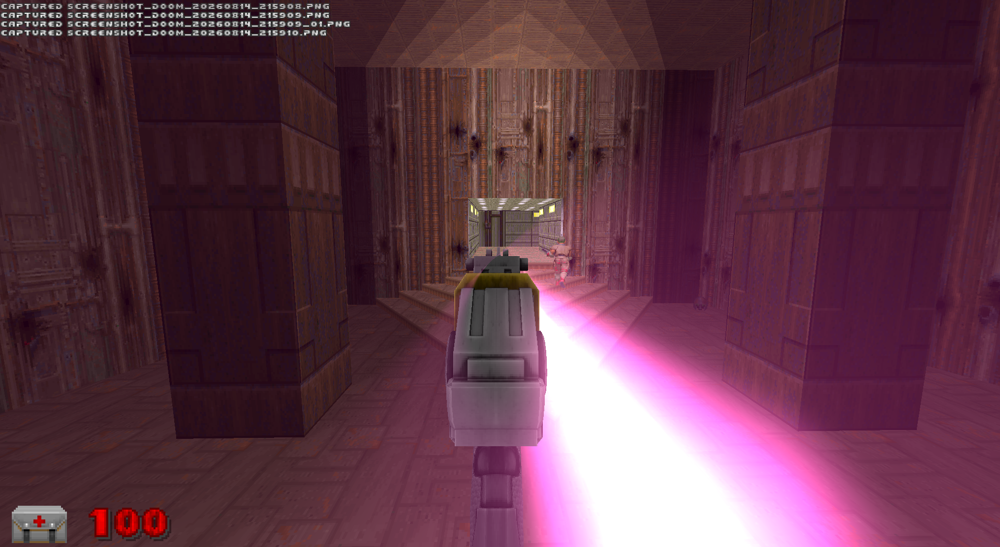
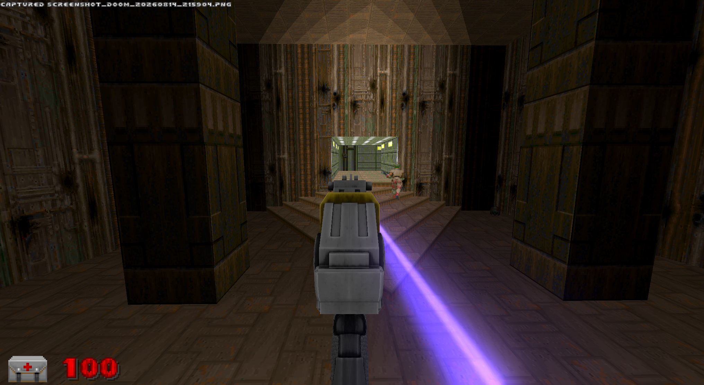

# The Lance

A real beam weapon for the **UZDXREMA** engine fork.

Not a sprite. Not a chain of puffs. Not a stretched quad. The beam is a
*segment light* — the engine lights every pixel by its distance from the line,
so it is continuous at any length, wraps floor/wall/ceiling as one unbroken
object, hangs visibly in the air, correctly disappears behind walls, feeds
bloom on its own, and lights the surfaces near it because they **are** near it.
Nothing is spawned to fake any of that.

And it does not fire. There are no shots. The beam is **on**, and while it is on
it deposits energy at a rate.

| | |
|---|---|
|  |  |
|  |  |
|  |  |

---

## ⚠ Requires the fork. It will not run on stock GZDoom.

It does not merely fail at runtime — **it does not compile.**

| Needs | For |
|---|---|
| `Level.SetBeam` / `SetBeamCount` / `SetBeamLook` | drawing the beam at all |
| `Level.SetVolumetricBeam` | the lit air around it |
| `AttackPos` / `OffhandPos` / `OverrideAttackPosDir` / `Weapon.LaserBeamOffset` | tracked-hand aim and the muzzle origin |

The first two groups are UZDXREMA's own (`FORK_CHANGES.md` §13 and §4). The
third comes from its VR lineage.

**Desktop / PCVR only.** The beam renderer is not implemented on GLES, so this
cannot work on Quest or any mobile GL path — it would load, compile, and draw
nothing. A laser gun with no laser.

## Load it

```bash
doomxr.exe -iwad doom2.wad -file RS_Lance
```

Loads as a loose directory or zipped as a `.pk3`. It replaces nothing and
touches no existing class, so it drops into other mods without conflict.

You spawn holding one, mainhand. To get the rest, find more.

---

## How it plays

### No ammo. Heat is the only resource.

Heat runs 0 to 100. Holding drives it up at 10/second — **ten full seconds** of
continuous fire before cook-off. Release and there is a short grace where
nothing bleeds, then it falls fast: about three seconds back to cold. Touch 100
and the weapon locks out for a flat five seconds and comes back **stone cold**,
so an overheat costs the whole climb, not just the wait.

Each hand has its own heat. They never heat each other.

### Seven rungs, and a ladder you climb by finding more of the gun

| tier | DPS at the top | what a ten-second hold does |
|---|---|---|
| 1 | 60 | one flat band. Blue. No gear changes. |
| 2 | 95 | gears once, halfway up |
| 4 | 235 | three gear changes |
| 7 | **900** | six gear changes, blue → magenta |

**The tier subdivides the heat bar; it does not cap it.** Every trigger pull
still starts cold, blue, at 60 DPS. What the tier buys is how many rungs that
same climb passes through. So an upgrade changes the *shape* of a burst rather
than its starting point — which is what makes it feel like a different weapon
instead of a bigger number.

### Why it cuts fodder like a shotgun but makes bosses a siege

One curve read from both ends, not two systems:

- A zombieman is 20hp and dies in a third of a second in band 1. You never leave
  the bottom band, so **clearing a room costs almost no heat** — the gun is
  still cold when the room is empty.
- A Baron is 1000hp. Band 1 would need sixteen seconds and you cook off at ten,
  so **band 1 physically cannot kill a boss.** You have to climb, climbing means
  holding, and holding is the thing that overheats you.

### Reading the beam

The colour is the gauge, and it tells you two things at once: within a burst,
how hot you are — across a run, how far up the ladder your gun has come. A
tier-1 player only ever sees deep blue. Seeing magenta at all means somebody is
carrying a fully built Lance.

Band changes flash white and fat for five tics, so the gear change reads in
peripheral vision while you are looking at what you are killing.

### Three layers

A wide soft **sheath** on the axis; a dense bright **core** whose muzzle end
orbits slowly; a thinner **filament** counter-rotating at a wider radius. Only
the start points move — both far ends stay pinned to the impact, so the moving
layers converge on the target rather than sliding off it. Stirred at the barrel,
dead accurate at the other end.

### Burning deaths

Anything the Lance kills catches fire. Five flame sets rolled per flame, half
mirrored, scattered through the victim's own volume and scaled to its size, so a
Cyberdemon burns like a Cyberdemon. Six screams across two `$random` groups with
pitch jitter — a room of burning zombies is a chorus, not one sound six times.
Leaves ash.

### Drops

2% of dead humanoids drop a Lance core. The **first** one you find is the second
gun — offhand, dual wield — *and* a rung. Every one after that is a rung, to a
maximum of seven.

---

## Tuning

| Where | What |
|---|---|
| `LNC_HEAT_RISE` | seconds to cook off (10.0/sec = 10s) |
| `LNC_HEAT_FALL` / `LNC_HEAT_GRACE` | how fast the ladder decays when you stop |
| `LNC_LOCKOUT` | cook-off penalty, in tics |
| `LNC_MAX_TIER` + `Band()` + `DPS()` + `CoreColor()` | the ladder itself |
| `LNC_MUZZLE_FWD/RIGHT/UP` | where the beam leaves the gun **on desktop** |
| `Weapon.LaserBeamOffset` | same, **in VR** (Y is forward, not X) |
| `LNC_DROP_PERMILLE` | drop chance, in tenths of a percent |

### Three things that will bite you

**`LaserBeamOffset` is not XYZ.** The engine builds its offset as
`(laser_y + weap.Y, laser_x + weap.X, laser_z + weap.Z)` and applies `.X` along
*forward*, `.Y` along *side*. So **Y means forward**. The code mirrors this so
the beam and the engine's own VR laser sight emit from one point.

**`SetBeamLook` and the glow term of `SetBeamCount` are frame-global.** Single
vec4s in the viewpoint block, not arrays. Every beam on screen shares them, last
caller each tic wins. Per beam you only get start, end, thickness, softness,
colour and intensity.

**Scroll depth must stay at zero.** `main.fp` modulates brightness by
`sin(along * 0.06 - timer*speed)`, and that sine is the only periodic term in
the entire beam shader. Wavelength is ~105 world units, so any nonzero value
stamps a bright/dark band every 105 units and a beam across a room reads as a
string of beads rather than a solid bar.

There are **8 beam slots** total; this weapon uses six, three per hand.
Each active slot costs a per-pixel segment test across the whole screen, twice —
once for surface lighting, once for the glow in the air.

---

## Credits

This is a mod, and it stands on other people's work.

- **Bolter model and skin**, plasma foley, and the weapon sprite frames are from
  **MeatGrinder** (`meatgrinderV2C`).
- **Flame, ash and burn-scream assets** come from the RS_Main art library and
  carry the mixed provenance of that collection.
- The **beam, volumetric and VR systems** are UZDXREMA's.

Extracted from RS_Main's `RS_LaserGun`. If you own any of the above and want it
removed, say so and it goes.
