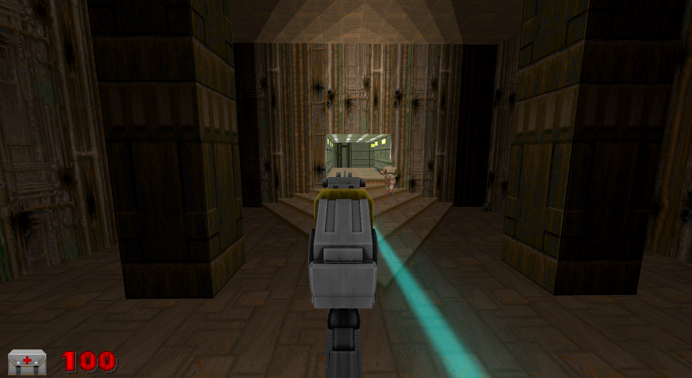
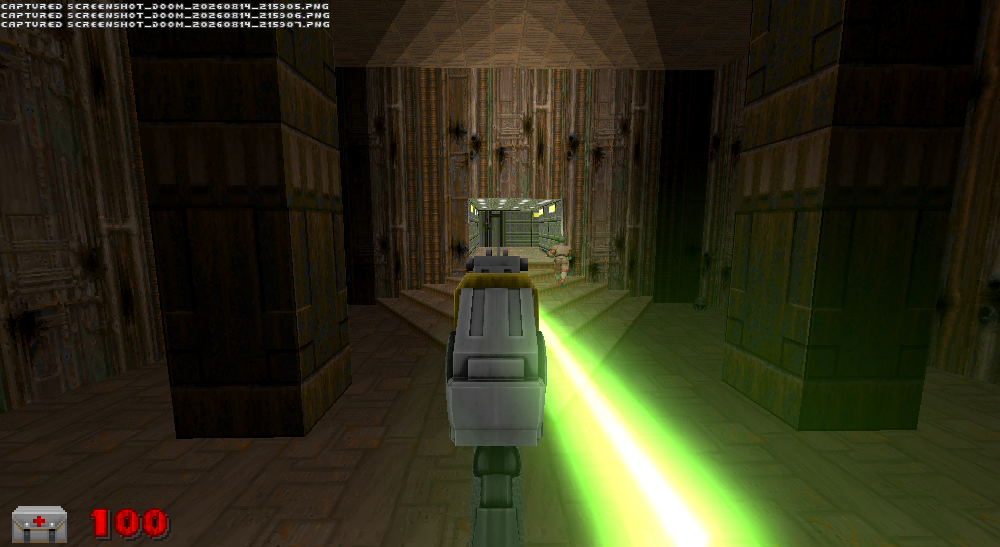
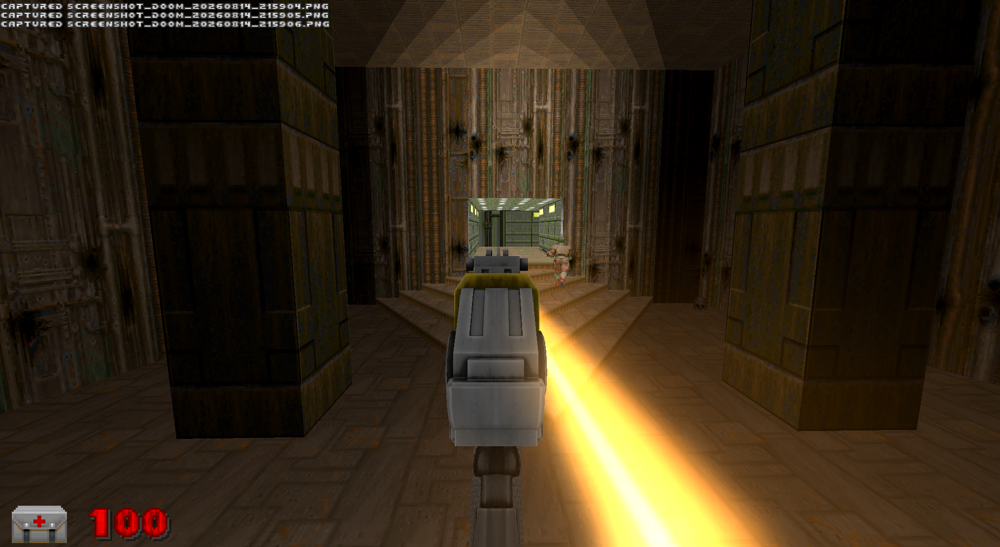
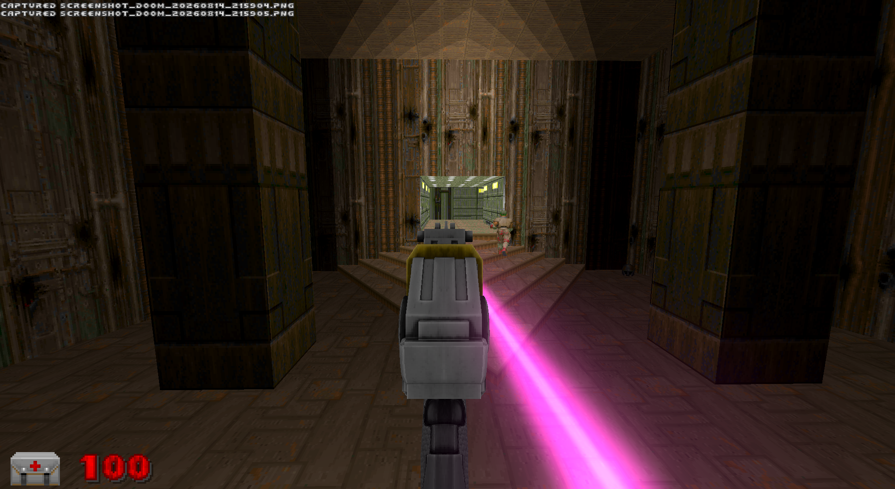

# The Lance

A real beam weapon for the **UZDXREMA** engine fork. Not a sprite, not a chain
of puffs — the engine lights every pixel by its distance from the beam, so it is
continuous at any length, hangs in the air, and lights the room it crosses.

And it doesn't fire. There are no shots. It's **on**, and while it's on it burns.

| | |
|---|---|
|  |  |
|  |  |

---

## It gets stronger when you find more of it

**2% of dead humanoids drop a Lance core.**

- **First one** → a second Lance, in your off hand. Dual wield. *And* a tier.
- **Every one after** → another tier, up to seven.

You start with one gun at tier 1: a flat blue beam, 60 DPS, no gear changes.
A tier-7 Lance climbs six gear changes in a single trigger pull and tops out at
**900 DPS**, blue through green and gold to magenta.

The tier doesn't raise your floor — **it raises your ceiling.** Every pull still
starts cold, blue, at 60. What the tier buys is how many rungs that same
ten-second climb passes through. An upgrade changes the *shape* of a burst, not
where it begins.

Seeing magenta at all means someone is carrying a fully built Lance.

## No ammo. Heat is the only limit.

Ten seconds of held fire before it cooks off. Release and it drops back to cold
in about three. Cook off and you're locked out for five seconds and come back
**stone cold** — an overheat costs the whole climb, not just the wait.

Each hand has its own heat. They never heat each other.

**Fodder dies in the bottom band**, so clearing a room costs almost no heat —
the gun is still cold when the room is empty. **A Baron can't be killed in the
bottom band at all** — sixteen seconds of damage against ten seconds of uptime.
Bosses force the climb. Same curve, read from both ends.

Anything it kills catches fire and burns down to ash.

---

## Requires the fork

**It will not compile on stock GZDoom**, let alone run. It needs `Level.SetBeam`,
`SetVolumetricBeam`, and the VR hand-tracking positions.

**Desktop / PCVR only.** The beam renderer isn't implemented on GLES, so Quest
and mobile GL are out — it would load and draw nothing.

```bash
doomxr.exe -iwad doom2.wad -file RS_Lance
```

Drops into other mods cleanly — replaces nothing, touches no existing class.

---

## Tuning

| | |
|---|---|
| `LNC_HEAT_RISE` / `FALL` / `GRACE` / `LOCKOUT` | the heat model |
| `Band()` `DPS()` `CoreColor()` `LNC_MAX_TIER` | the ladder |
| `LNC_DROP_PERMILLE` | drop chance, tenths of a percent |
| `LNC_MUZZLE_FWD/RIGHT/UP` | beam origin on desktop |
| `Weapon.LaserBeamOffset` | beam origin in VR — **Y is forward, not X** |

**Three things that will bite you**, all of which cost real time to find:

1. `LaserBeamOffset` is not XYZ. The engine applies `.Y` along *forward*.
2. `SetBeamLook` and `SetBeamCount`'s glow are **frame-global**, not per-beam.
   Last caller each tic wins for everything on screen.
3. **Scroll depth must stay 0.** `main.fp` modulates brightness on a ~105-unit
   sine — the only periodic term in the whole beam shader. Any nonzero value
   turns a beam across a room into a string of beads.

8 beam slots exist; this uses six, three per hand. Each costs a per-pixel
segment test across the screen, twice.

---

## Credits

Bolter model, skin and foley: **MeatGrinder** (`meatgrinderV2C`). Flame, ash and
scream assets: the RS_Main art library, mixed provenance. Beam, volumetric and
VR systems: **UZDXREMA**. Extracted from RS_Main's `RS_LaserGun`.

If you own any of it and want it gone, say so and it goes.
